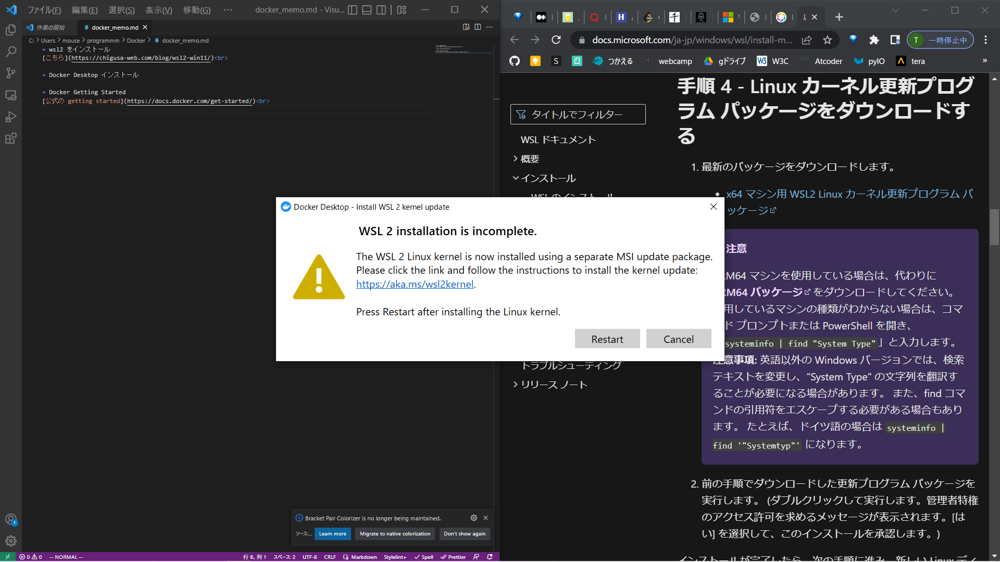

#### **コンテナ何度も作成・起動する場合**
" dokcer run -rm "オプションをつけておくと楽。コンテナを落とす度にコンテナ自体が削除される 

#### **dockerfile をビルドしてみる**
[こちらのサイトを参考としてすすめる](https://unskilled.site/docker%E3%82%B3%E3%83%B3%E3%83%86%E3%83%8A%E3%81%AE%E4%B8%AD%E3%81%A7gui%E3%82%A2%E3%83%97%E3%83%AA%E3%82%B1%E3%83%BC%E3%82%B7%E3%83%A7%E3%83%B3%E3%82%92%E8%B5%B7%E5%8B%95%E3%81%95%E3%81%9B%E3%82%8B/) 
- docker image の取得と Dockerfile の作成 
よくわからんけど、" docker images " で確認するとしっかり debian が取得されてる。ver は最新っぽい？ 

- " FROM debian:8.6 " としてたものを、 " FROM debian " とすると、" docker build . " がうまくいった 
イメージとして DL したの、最新版だもんね。そりゃそうだ。 
" docker build -t [イメージファイルの_path] " としてつかえるっぽいけど、別にないなら勝手に探してくれるのかな 

- RUN, CMD, ENTRYPOINT 
RUN => docker image を作成する際に実行されるコマンド 
ENTRYPOINT => コンテナを実行したときに**必ず**実行されるコマンド 
CMD => コンテナを実行したときに**デフォルトで**実行されるコマンド 
とりあえず、CMD はコンテナ起動時に実行、run はイメージ作成時に一回だけ実行との認識でいいっしょ！！ 
[参考はこちら](https://penpen-dev.com/blog/docker-cmd-entrypoin/) 

- docker run にを実施 
" dokcer build . " で docker image を作成。 " docker images " を実行すると、新しい image ができてる 
" docker run [ID] " にてイメージを起動するが、何も起きない。 => 原因は -it をつけていないこと 
[-it_はどんな役割をしているのか、何故すぐにプロセスが終了してしまうのか](https://architecting.hateblo.jp/entry/2020/08/13/153842) 
なるほどね、docker はあくまで一つの OS 上のプロセスでしかないので、完了したら終了しちゃう 
root process(コンテナ上で最初に実行されるプロセス,PID=1)が、シェルだった場合、-it をつけないといけない 
- -i >> 標準入力を、割り当てる。なるほど、これで bash を操作できるようになる？？正確じゃないが。 
" docker run -i "　だと、何も表示されない。 
- -t >> tty の略。現在使用しているターミナルを、コンテナ内の bash へ割り当てる？？っぽい,正確理解じゃない 
[このサイトで-ttyで検索。わかりやすい](https://qiita.com/R_R/items/40d256389b59b66eaf6b) 
制御操作（esc や カーソルなど、os へ直接指示を与えるコマンド）を使用できるようにするために必要なのね、腹落ち 
" docker run -t " だと、bash起動するが、何も入力できねぇ 
- cf) tty は標準入出力を取り扱う仮想ファイル。ユーザーがログインすると、/dev/pts/n のファイルが割り当てあられて、そこに echo とかすると入出力される 
[tty_はいまいち把握できていなけどとりあえずこれがわかりやすいか？](https://takuya-1st.hatenablog.jp/entry/20101024/1287947368) 

- " docker -d " 
--detach らしい。これをしないと、コンテナ内 bash から exit すると同時に、コンテナも終了しちゃうんだって 

#### wsl2 をインストール
[こちら](https://chigusa-web.com/blog/wsl2-win11/) 

#### Docker Desktop インストール

#### wsl2 が最新じゃないよエラー
 

でてきたリンクの通り、wsl2 をアップデートすることで解決。 

#### Docker Getting Started
[公式の getting started](https://docs.docker.com/get-started/) 
チュートリアルに従って進めばOK 
[getting started 2](http://localhost/tutorial/) 

#### コンテナとは？
a container is simply another process on your machine that has been isolated from all other processes on the host machine　だそう 
- コンテナイメージ
ファイルシステムのまるっとコピーを含んでる。これにアプリケーションとかに必要な要素がすべてそろってるんだって。 
- Docker Desktop
これ、virtual box と同じで環境管理のためのものか。 

#### アプリのビルド
[getting started 3](http://localhost/tutorial/our-application/) 
- Dockerfile の作成
アプリディレクトリのルートに、Dockerfile を作成するっぽい? 
docker build -t getting-started .  >>> Dockerfile をもとに、コンテナを作成 
場所を指定して、どのコンテナを使用するか引っ張って環境を構築するのかな？ 

#### アプリのアップデート
毎回ビルドして、ポートを設定してサーバーをたてるのかな？ 
昔のコンテナは docker ps で id 探して、 docker rm [id]　で削除 

#### docker の起動
" docker ps -a " で起動していないコンテナも確認できる 

" docker start [id or name] " で起動 ( docker ps っで STATUS が Up となる )  
" docker stop [id or name] " で停止 

#### docker の IP アドレスの確認方法
" docker inspect [id_or_name] " で jsonででてくる。 
[こちらへどうぞ](https://mebee.info/2021/08/05/post-40153/) 
- docker にローカルホストから接続するには
ループバックアドレスを使ってください、docker の ipアドレスは関係ないです 
[こちらが_docker_へローカルから接続する方法](https://www.distant-view.co.jp/column/3107/) 

#### docker チュートリアル(nginx)
[こちら、nginx](https://knowledge.sakura.ad.jp/13795/) 